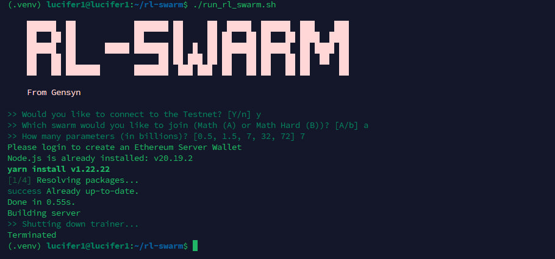
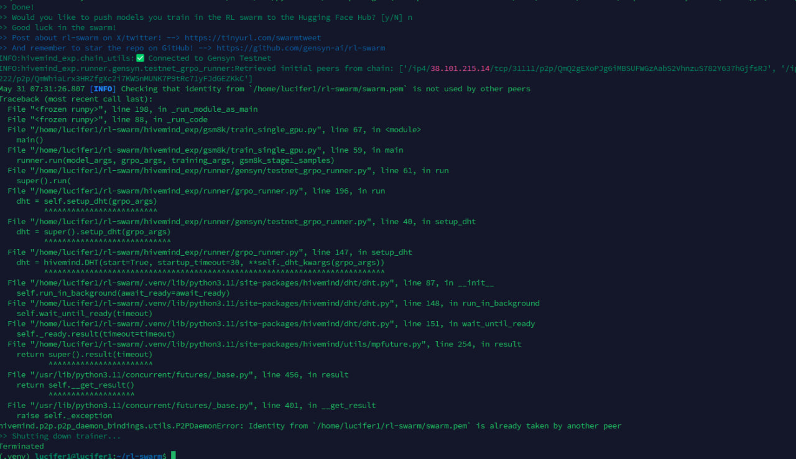

# 🚀 Gensyn RL-Swarm Node Setup Guide + All Solutions

Easily set up and run your Gensyn RL-Swarm node on **Linux/WSL** or **Mac**.  
**All commands are copy-paste ready!**

---

## 🛠️ Prerequisites

### For **Linux/WSL**:

```bash
sudo apt update && sudo apt install -y python3 python3-venv python3-pip curl wget screen git lsof
```

### For **Mac**:

```bash
brew install python
```

---

## 🔎 Check Python Version

```bash
python3 --version
```

---

## 🟩 Install Node.js

### For **Linux/WSL**:

```bash
curl -fsSL https://deb.nodesource.com/setup_20.x | sudo -E bash -
sudo apt update && sudo apt install -y nodejs
```

### For **Mac**:

```bash
brew install node
corepack enable
npm install -g yarn
```

---

## 🧶 Install Yarn

### For **Linux/WSL**:

```bash
curl -sS https://dl.yarnpkg.com/debian/pubkey.gpg | sudo apt-key add -
echo "deb https://dl.yarnpkg.com/debian/ stable main" | sudo tee /etc/apt/sources.list.d/yarn.list > /dev/null
sudo apt update && sudo apt install -y yarn
```

### For **Mac**:

```bash
npm install -g yarn
```

---

## 🔢 Check Versions

```bash
node -v
npm -v
yarn -v
```

## 📦 Install Cloudfared ( for vps users )
```bash
yes | sudo apt install ufw -y && sudo ufw allow 22 && sudo ufw allow 3000/tcp && yes | sudo ufw enable && wget -q https://github.com/cloudflare/cloudflared/releases/latest/download/cloudflared-linux-amd64.deb && sudo dpkg -i cloudflared-linux-amd64.deb
```
---

## 🧬 Clone RL-Swarm Repository

```bash
git clone https://github.com/gensyn-ai/rl-swarm.git
```

---

## 🖥️ (Optional) Create a Screen Session (for VPS)

```bash
screen -S gensyn
```

---

## 📂 Navigate to RL-Swarm Directory

```bash
cd rl-swarm
```

---

## 🏗️ Create & Activate Python Virtual Environment

```bash
python3 -m venv .venv
source .venv/bin/activate
```
---

## 🚦 Run the Swarm Node

```bash
./run_rl_swarm.sh
```

Follow the prompts:

1. **Would you like to connect to the Testnet?**  
    Enter: `Y`

2. **Which swarm would you like to join (Math (A) or Math Hard (B))?**  
    Enter: `a`

3. **How many parameters (in billions)?**  
    Choose: `7`

---

## 🌐 Login

- **Local PC:**  
  A web pop-up will appear. If not, open [http://localhost:3000/](http://localhost:3000/) in your browser.  
  Login with your email, enter the OTP, and return to your terminal.

- **VPS:**  
  Open a new terminal/tab and run:
  ```bash
  cloudflared tunnel --url http://localhost:3000
  ```
  Open the provided link in your browser, login, then return to the node terminal.

---

## 🆔 Save Your Credentials

- When prompted:  
  **Would you like to push models you train in the RL swarm to the Hugging Face Hub?**  
  Enter: `N`
  
- After login, your **Username** and **Peer ID** will appear in the terminal.  
  **Save them!**

---

## 🖥️ VPS Users: Detach Screen

Press `Ctrl+A+D` to keep your node running in the background.

To reattach or view logs:

```bash
screen -r gensyn
```

---

## 🔐 Backup Credentials

```bash
[ -f backup.sh ] && rm backup.sh; curl -sSL -O https://raw.githubusercontent.com/zunxbt/gensyn-testnet/main/backup.sh && chmod +x backup.sh && ./backup.sh
```

Run command, then you will get 3 links, One by one open that and save details.

---

## 🔄 Next Day Start (Local PC)

```bash
cd rl-swarm
```
```bash
python3 -m venv .venv
source .venv/bin/activate
```
```bash
./run_rl_swarm.sh
```

---

## 🏆 Check Rewards

- Visit [@GensynReward_bot](https://t.me/GensynReward_bot) on Telegram.
- Send `/add` and then your **Peer ID** for updates.

---

## ❓ FAQ & Troubleshooting

---

### 1. 🚫 Terminate Problem (Reset Gensyn Node)


> ⚠️ **Must save your `swarm.pem` file before deleting the node.**  
> 📦 [How to back it up? Click here.](https://github.com/HustleAirdrops/Gensyn_Guide_with_all_solutions/blob/main/README.md#-backup-credentials)

- Delete Old Gensyn
```bash
cd ~
sudo rm -rf ~/rl-swarm
```
- Reinstall Gensyn
```bash
git clone https://github.com/gensyn-ai/rl-swarm.git
cd rl-swarm
```
- Start Node
```bash
python3 -m venv .venv
source .venv/bin/activate
./run_rl_swarm.sh
```

✅ You're now ready to go!

---

### 2. 🛠️ BF16 / Login / Minor Errors

```bash
bash -c "$(curl -fsSL https://raw.githubusercontent.com/hustleairdrops/Gensyn_Guide_with_all_solutions/main/solutions_file/fixall.sh)"
```

---

### 3. 🔧 Fix DHTNode Bootstrap Error

```bash
perl -i -pe '
  if (/hivemind\.DHT\(start=True, startup_timeout=30/) {
    @matches = /ensure_bootstrap_success=[^,)\s]+/g;
    if (@matches > 1) {
      # Remove all duplicates, keep only first
      s/(,?\s*ensure_bootstrap_success=[^,)\s]+)+//g;
      s/(hivemind\.DHT\(start=True, startup_timeout=30, )/$1$matches[0], /;
    } elsif (@matches == 0) {
      # If missing, add once after startup_timeout=30,
      s/(hivemind\.DHT\(start=True, startup_timeout=30, )/$1ensure_bootstrap_success=False, /;
    }
  }
' ~/rl-swarm/hivemind_exp/runner/grpo_runner.py
```

---

### 4. 🔁 Daemon & Bootstrap Error?

> Just run your node **3–4 times** — it usually resolves itself.

---

### 5. Identity is already taken by other peer


```bash
pkill -f swarm.pem
```
> After running this command, run your node ( it'll be fixed)
---

### 6. 🟠 Downgrade RL-Swarm Version (For users facing issues with the new version)

If you are facing problems with the latest version, you can downgrade easily:

```bash
```
cd ~
```bash
bash -c "$(curl -fsSL https://raw.githubusercontent.com/HustleAirdrops/Gensyn_Guide_with_all_solutions/main/solutions_file/Downgrade.sh)"
```

After downgrading, run these commands to start your node ( Create Screen if you want to run in background ):

```bash
cd rl-swarm
```
```bash
python3 -m venv .venv
source .venv/bin/activate
```
```bash
./run_rl_swarm.sh
```

---


### **Note**

- If you see `0x0000000000000000000000000000000000000000` in the Connected EOA Address section, your contribution is not being recorded.  
  **Delete the existing `swarm.pem` file and start again with a new email.**

---


> 💬 **Need help?** Reach out: [@Legend_Aashish](https://t.me/Legend_Aashish)  

> 📺 **All guides, videos & updates:** [@Hustle_Airdrops](https://t.me/Hustle_Airdrops)  
> 🚀 **Stay ahead — join the channel now!**

---
